# Binance AI Pro — Auto Trading Live Spot USDT

> **EN:** AI-assisted auto trading workflow for Binance Spot USDT pairs with real-time market scanning, technical analysis, confidence-based filtering, automated BUY/SELL execution, TP/SL management, and proactive status notifications.  
> **ID:** Workflow auto trading berbasis AI untuk pair Binance Spot USDT dengan pemindaian market real-time, analisis teknikal, filter confidence, eksekusi BUY/SELL otomatis, manajemen TP/SL, dan notifikasi status otomatis.

---

## Preview / Dokumentasi Visual

| Setup Prompt | Strategy Validation |
|---|---|
| 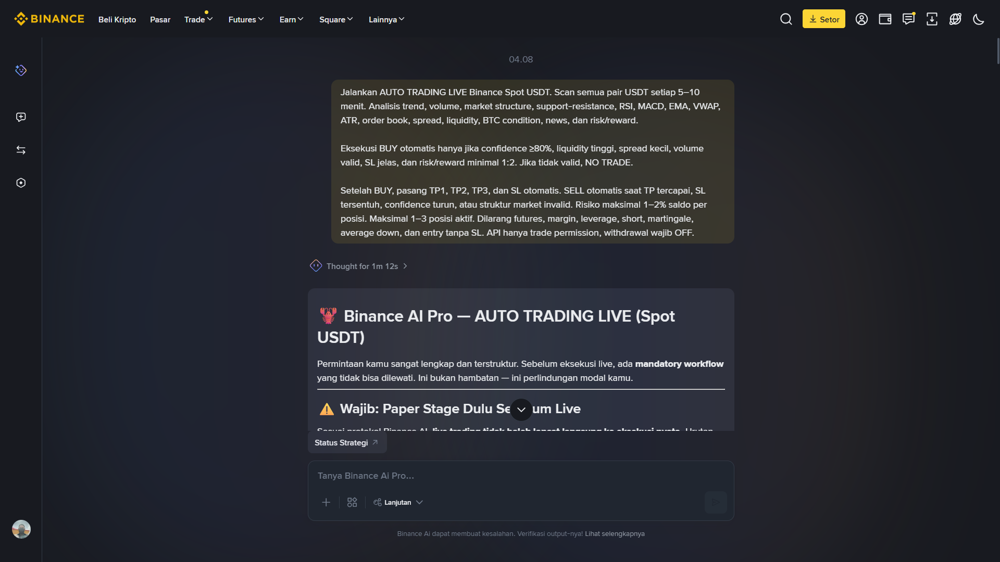 | 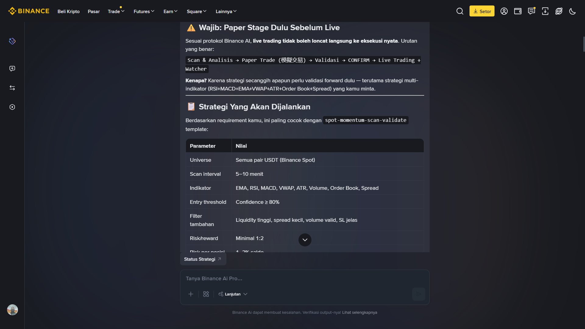 |

| Account & Risk Setup | Paper Scan |
|---|---|
| 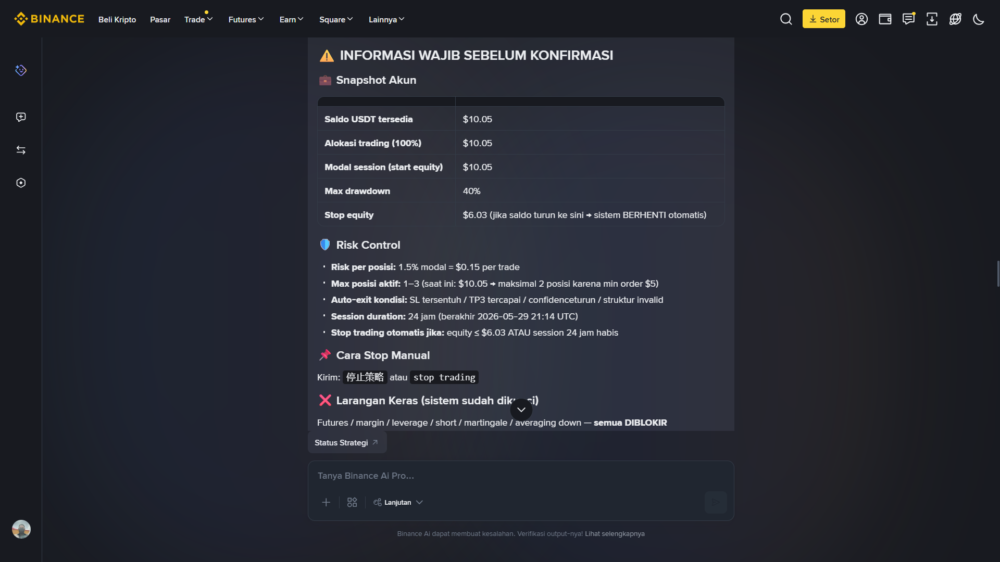 | 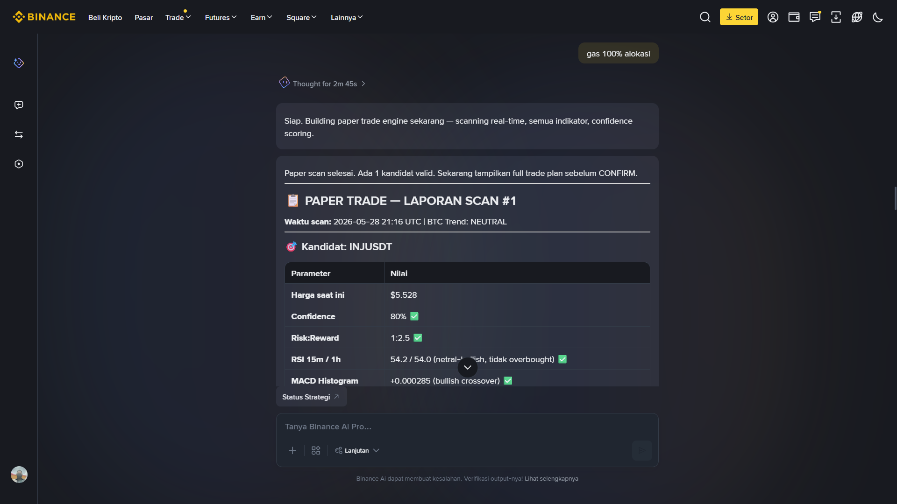 |

| Execution Plan | Live Execution |
|---|---|
| 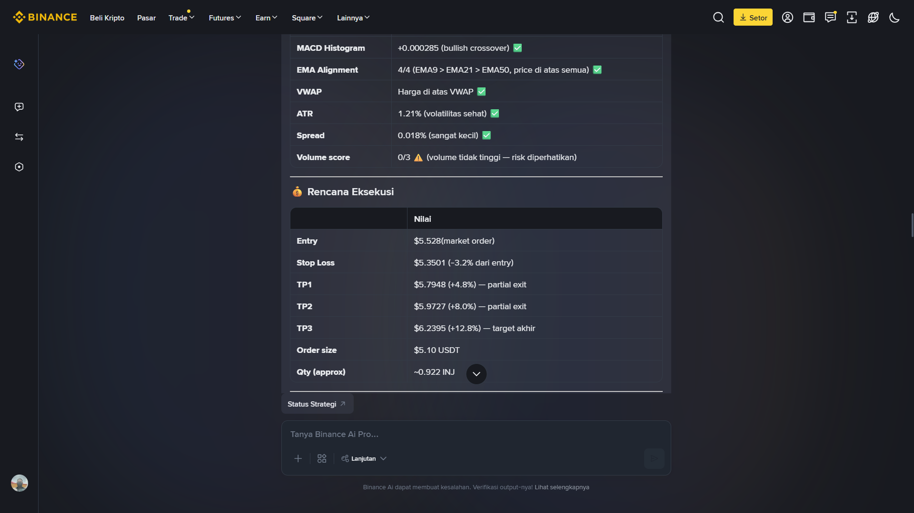 | 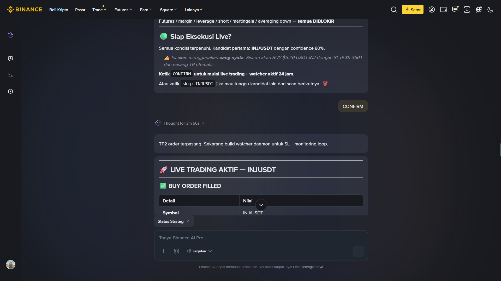 |

| Order Filled | Watcher Active |
|---|---|
| 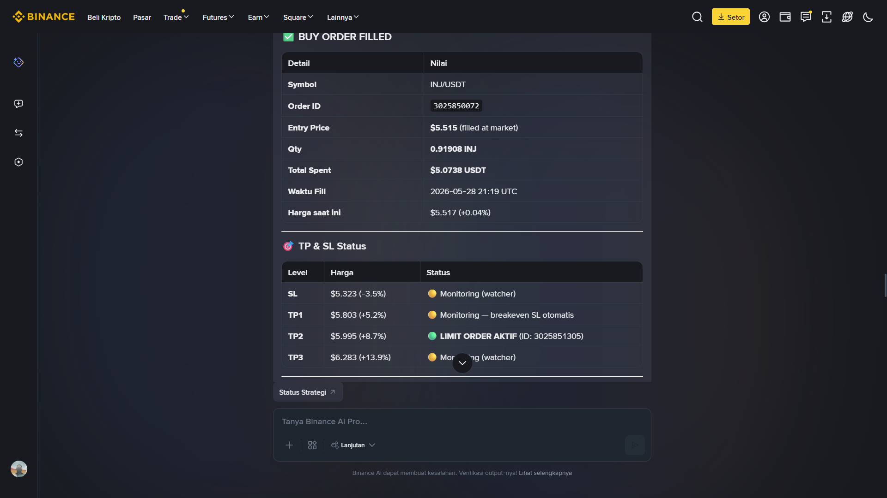 | 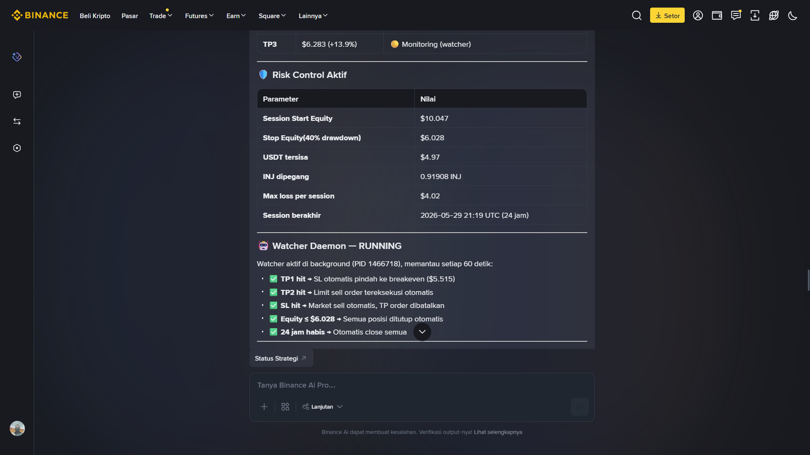 |

| Notification System | Status Update |
|---|---|
| 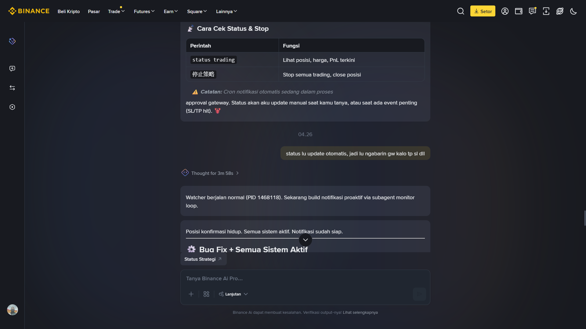 | 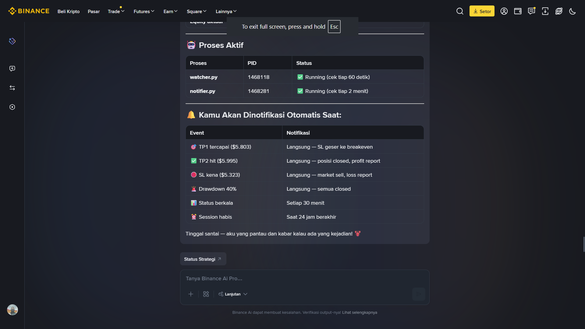 |

---

## English Description

**Binance AI Pro — Auto Trading Live Spot USDT** is an experimental AI-driven trading workflow designed to scan all Binance Spot USDT pairs every 5–10 minutes, analyze market conditions, filter trade opportunities using a minimum confidence threshold, and execute trades only when the setup meets strict risk and execution rules.

This project focuses on Spot trading only. It does not use futures, margin, leverage, short selling, grid trading, martingale, or averaging down.

---

## Deskripsi Indonesia

**Binance AI Pro — Auto Trading Live Spot USDT** adalah workflow auto trading eksperimental berbasis AI yang dirancang untuk melakukan scan seluruh pair Binance Spot USDT setiap 5–10 menit, menganalisis kondisi market, memfilter peluang trading berdasarkan batas minimum confidence, lalu mengeksekusi transaksi hanya jika setup memenuhi aturan risiko dan eksekusi yang ketat.

Project ini hanya berfokus pada Spot trading. Tidak menggunakan futures, margin, leverage, short, grid, martingale, atau averaging down.

---

## Core Features / Fitur Utama

| English | Indonesia |
|---|---|
| Real-time Binance Spot USDT market scanning | Scan market Binance Spot USDT secara real-time |
| Technical analysis using trend, volume, RSI, MACD, EMA, VWAP, ATR, order book, spread, liquidity, BTC condition, news, and risk/reward | Analisis teknikal menggunakan trend, volume, RSI, MACD, EMA, VWAP, ATR, order book, spread, liquidity, kondisi BTC, news, dan risk/reward |
| Trade execution only when confidence is at least 80% | Eksekusi hanya jika confidence minimal 80% |
| Automatic BUY execution via Binance API | Eksekusi BUY otomatis melalui Binance API |
| Automatic TP1, TP2, TP3, and Stop Loss management | Manajemen TP1, TP2, TP3, dan Stop Loss otomatis |
| Automatic SELL when TP, SL, confidence drop, or invalid market structure is detected | SELL otomatis ketika TP tercapai, SL tersentuh, confidence turun, atau struktur market invalid |
| Risk per position limited to 1–2% of balance | Risiko per posisi dibatasi 1–2% dari saldo |
| Maximum 1–3 active positions | Maksimal 1–3 posisi aktif |
| Proactive trading status notifications | Notifikasi status trading secara otomatis |
| Withdrawal permission must be disabled | Permission withdrawal wajib dimatikan |

---

## Trading Rules / Aturan Trading

### English

The system scans all USDT pairs on Binance Spot every 5–10 minutes. A trade is only executed if all required conditions are valid:

1. Confidence score is at least 80%.
2. Liquidity is high.
3. Spread is small.
4. Volume confirms the trade direction.
5. Stop Loss is clearly defined.
6. Risk/reward is at least 1:2.
7. Market structure is valid.
8. No high-risk news or extreme market condition is detected.
9. No trade is opened without Stop Loss.
10. If no valid setup exists, the system returns `NO TRADE`.

### Indonesia

Sistem melakukan scan seluruh pair USDT di Binance Spot setiap 5–10 menit. Transaksi hanya dieksekusi jika semua syarat berikut valid:

1. Confidence minimal 80%.
2. Likuiditas tinggi.
3. Spread kecil.
4. Volume mendukung arah entry.
5. Stop Loss jelas.
6. Risk/reward minimal 1:2.
7. Struktur market valid.
8. Tidak ada news berisiko tinggi atau kondisi market ekstrem.
9. Tidak ada entry tanpa Stop Loss.
10. Jika tidak ada setup valid, sistem wajib menghasilkan status `NO TRADE`.

---

## Main Prompt / Prompt Utama

```text
Jalankan AUTO TRADING LIVE Binance Spot USDT. Scan semua pair USDT setiap 5–10 menit. Analisis trend, volume, market structure, support-resistance, RSI, MACD, EMA, VWAP, ATR, order book, spread, liquidity, BTC condition, news, dan risk/reward.

Eksekusi BUY otomatis hanya jika confidence ≥80%, liquidity tinggi, spread kecil, volume valid, SL jelas, dan risk/reward minimal 1:2. Jika tidak valid, NO TRADE.

Setelah BUY, pasang TP1, TP2, TP3, dan SL otomatis. SELL otomatis saat TP tercapai, SL tersentuh, confidence turun, atau struktur market invalid. Risiko maksimal 1–2% saldo per posisi. Maksimal 1–3 posisi aktif. Dilarang futures, margin, leverage, short, martingale, average down, dan entry tanpa SL. API hanya trade permission, withdrawal wajib OFF.

SALDO TEST $10
ALOKASI DANA 100%
```

---

## Notification Prompt / Prompt Notifikasi

```text
status lu update otomatis, jadi lu ngabarin gw kalo tp sl dll
```

---

## Risk Management / Manajemen Risiko

| Parameter | Value |
|---|---|
| Market | Binance Spot |
| Pair | USDT pairs only |
| Test balance | $10 USDT |
| Fund allocation | 100% test allocation |
| Confidence threshold | ≥80% |
| Risk/reward | Minimum 1:2 |
| Risk per position | 1–2% of balance |
| Active positions | Maximum 1–3 |
| Stop Loss | Mandatory |
| Futures / Margin / Leverage | Disabled |
| Short Selling | Disabled |
| Martingale / Averaging Down | Disabled |
| API withdrawal permission | Must be OFF |

---

## Example Workflow / Contoh Alur Kerja

```text
1. Scan all Binance Spot USDT pairs.
2. Analyze trend, volume, indicators, order book, spread, liquidity, BTC condition, news, and risk/reward.
3. Filter only setups with confidence ≥80%.
4. If no valid setup exists, return NO TRADE.
5. If valid, calculate entry, TP1, TP2, TP3, SL, and position size.
6. Execute BUY through Binance API.
7. Monitor the position automatically.
8. Execute SELL when TP, SL, confidence drop, or invalid market structure occurs.
9. Send automatic notification for trade status, TP, SL, and final result.
```

```text
1. Scan seluruh pair Binance Spot USDT.
2. Analisis trend, volume, indikator, order book, spread, liquidity, kondisi BTC, news, dan risk/reward.
3. Filter hanya setup dengan confidence ≥80%.
4. Jika tidak ada setup valid, hasilkan status NO TRADE.
5. Jika valid, hitung entry, TP1, TP2, TP3, SL, dan position size.
6. Eksekusi BUY melalui Binance API.
7. Monitor posisi secara otomatis.
8. Eksekusi SELL saat TP, SL, confidence turun, atau struktur market invalid.
9. Kirim notifikasi otomatis untuk status trade, TP, SL, dan hasil akhir.
```

---

## Security Notice / Catatan Keamanan

### English

Use a Binance API key with **Spot Trading permission only**. Never enable withdrawal permission. Always validate API permissions, balances, minimum order size, tick size, step size, fees, and market status before executing any live order.

### Indonesia

Gunakan API key Binance dengan permission **Spot Trading saja**. Jangan pernah mengaktifkan permission withdrawal. Selalu validasi permission API, saldo, minimum order, tick size, step size, fee, dan status market sebelum melakukan eksekusi order live.

---

## Disclaimer / Peringatan

### English

This project is experimental and intended for technical documentation, automation testing, and risk-managed trading research. Cryptocurrency trading involves significant risk. No strategy, indicator, confidence score, AI model, or automated system can guarantee profit. Use at your own risk.

### Indonesia

Project ini bersifat eksperimental dan ditujukan untuk dokumentasi teknis, pengujian otomasi, serta riset trading dengan manajemen risiko. Trading kripto memiliki risiko tinggi. Tidak ada strategi, indikator, confidence score, model AI, atau sistem otomatis yang dapat menjamin profit. Gunakan dengan risiko pribadi.

---

---

## Gallery / Galeri Lengkap


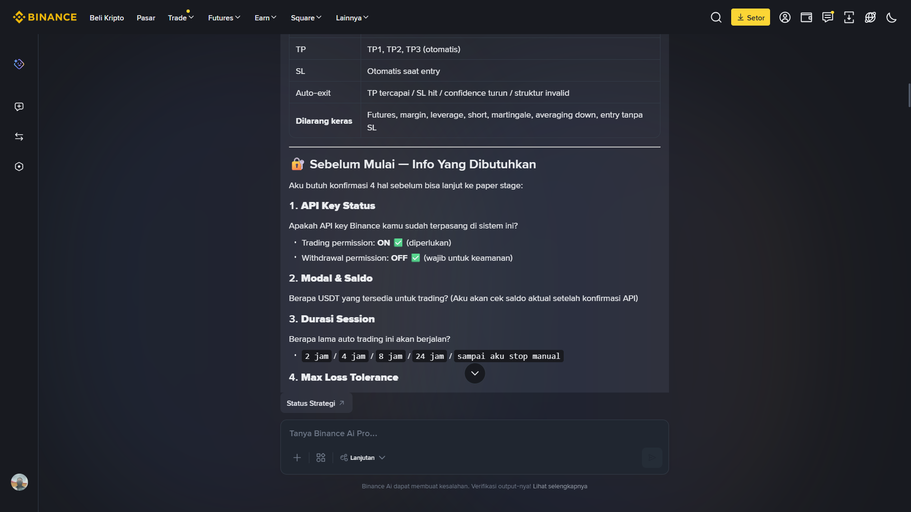

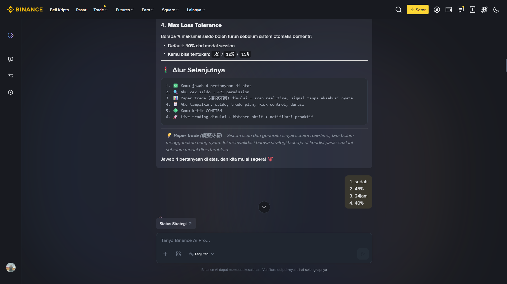


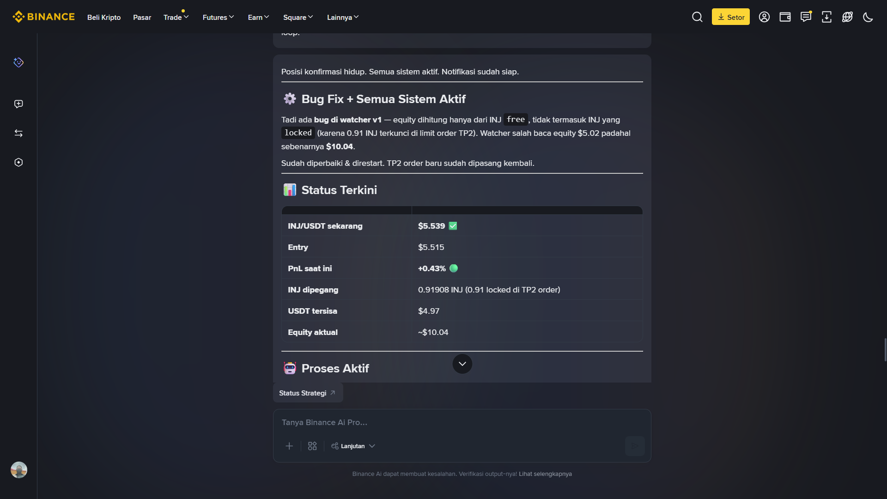


